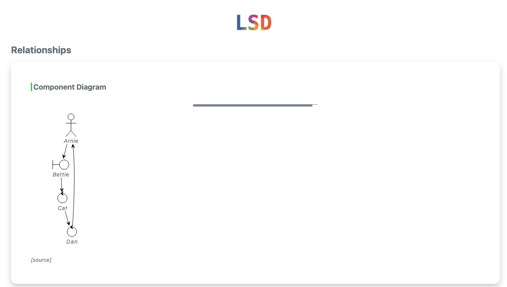
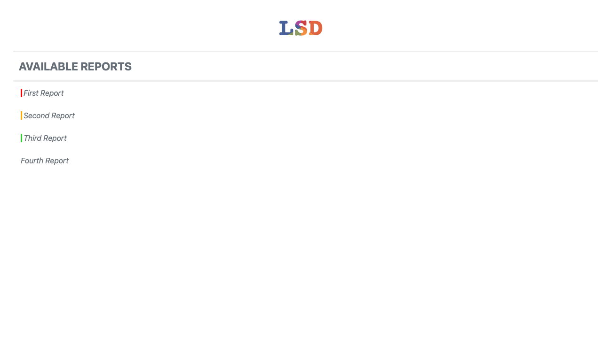

[](https://github.com/semantic-release/semantic-release)
[](https://github.com/lsd-consulting/lsd-core/actions/workflows/ci.yml)
[](https://github.com/lsd-consulting/lsd-core/actions/workflows/nightly.yml)
[](https://github.com/lsd-consulting/lsd-core/releases)
[](https://search.maven.org/search?q=g:%22io.github.lsd-consulting%22%20AND%20a:%22lsd-core%22)
[](https://www.jsdelivr.com/package/gh/lsd-consulting/lsd-core)

# LSD Core

> Living Sequence Diagrams - Automatically generate interactive sequence diagrams from your code

LSD Core transforms how you document system interactions. Instead of manually maintaining sequence diagrams that quickly become stale, **capture interactions programmatically** and generate living documentation that stays in sync with your code.

**Key Features:**
- Generate sequence diagrams without writing PlantUML markup
- Interactive HTML reports with clickable event details
- Component diagrams showing system-wide relationships
- Automatic diagram splitting for complex flows
- Multiple output formats and customizable themes

**Use Cases:**
- Document API interactions in integration tests
- Visualize microservice communication patterns
- Debug complex distributed system flows
- Generate architecture documentation from tests
- Create onboarding materials automatically


## Table of Contents

- [Why LSD?](#why-lsd)
- [Quick Start](#quick-start)
- [Advanced Features](#advanced-features)
- [Configuration](#configuration)
- [Gallery](#gallery)
- [Ecosystem](#ecosystem)
- [FAQ](#faq)
- [Development](#development)

## Why LSD?

### Traditional Approach


**Problems:**
- Manual maintenance required
- Quickly becomes outdated
- No connection to actual code
- Limited interactivity

### LSD Approach

```kotlin
// In your test or application code
lsd.capture(
    message().from("User").to("API").label("POST /login"),
    message().from("API").to("Database").label("SELECT * FROM users"),
    message().from("Database").to("API").label("user data"),
    message().from("API").to("User").label("200 OK")
)
```

**Benefits:**
- Generated from actual execution
- Always in sync with code
- Interactive HTML with details
- Automatic from tests

### Features at a Glance

| Feature | Description |
|---------|-------------|
| **Zero Markup** | No PlantUML syntax to learn - just Java/Kotlin code |
| **Living Documentation** | Diagrams generated from actual execution, not manual drawings |
| **Interactive Reports** | Click any interaction to see full request/response details |
| **Multiple Diagrams** | Sequence diagrams + component diagrams from same data |
| **Test Integration** | JUnit 5 and Cucumber plugins available |
| **HTTP Interception** | Auto-capture REST/HTTP calls with interceptors |
| **Customizable** | Themes, colors, participant types, custom icons |
| **Large Diagram Support** | Auto-splitting for complex flows |
| **Offline Mode** | Works without internet (inline CSS/JS) |

## Quick Start

### Installation

Add the dependency to your project: [](https://search.maven.org/search?q=g:%22io.github.lsd-consulting%22%20AND%20a:%22lsd-core%22)

<details>
  <summary>Maven</summary>

```xml
<dependency>
    <groupId>io.github.lsd-consulting</groupId>
    <artifactId>lsd-core</artifactId>
    <version>X.X.X</version>
</dependency>
```

</details>

<details>
  <summary>Gradle</summary>

```groovy
implementation 'io.github.lsd-consulting:lsd-core:X.X.X'
```
</details>

### Basic Usage

Capture interactions using the `LsdContext` singleton:

<details open>
  <summary>Kotlin Example</summary>

```kotlin
fun main() {
    val lsd = LsdContext.instance

    // Capture message exchanges
    lsd.capture(
        messageBuilder()
            .from("User Service")
            .to("Auth Service")
            .label("POST /authenticate")
            .build(),
        messageBuilder()
            .from("Auth Service")
            .to("User Service")
            .label("200 OK")
            .data("$token")
            .build(),
    )

    // Complete the scenario and generate report
    lsd.completeScenario("User Authentication Flow")
    lsd.completeReport("Authentication API")
}
```
</details>

<details>
  <summary>Java Example</summary>

```java
public static void main(String[] args) {
    LsdContext lsd = LsdContext.getInstance();
    
    lsd.capture(
        messageBuilder()
            .from("User Service")
            .to("Auth Service")
            .label("POST /authenticate")
            .build(),
        messageBuilder()
            .from("Auth Service")
            .to("User Service")
            .label("200 OK {token}")
            .build()
    );
    
    lsd.completeScenario("User Authentication Flow");
    lsd.completeReport("Authentication API");
}
```
</details>

**Output:** The generated HTML report will be in `build/reports/lsd/` (configurable via properties).

### Real-World Example

Here's how you might document an order processing flow:

```kotlin
@Test
fun `process order with payment`() {
    val lsd = LsdContext.instance
    
    // Customer places order
    lsd.capture(
        messageBuilder()
            .from("Customer")
            .to("Order Service")
            .label("POST /orders {items, total}")
            .build()
    )
    
    // Order service validates and requests payment
    lsd.capture(
        messageBuilder()
            .from("Order Service")
            .to("Payment Service")
            .label("POST /payments {amount, card}")
            .build(),
        messageBuilder()
            .from("Payment Service")
            .to("Order Service")
            .label("200 OK")
            .data("<transactionId>")
            .build()
    )
    
    // Order confirmed
    lsd.capture(
        messageBuilder()
            .from("Order Service")
            .to("Customer")
            .label("201 Created")
            .data("<orderId>")
            .build()
    )
    
    lsd.completeScenario("Successful Order Processing")
    lsd.completeReport("E-Commerce API Flows")
}
```

This generates an interactive diagram showing the complete flow, with each arrow clickable to reveal request/response details.

## Advanced Features

### Customizing Participants

Enhance diagrams with typed participants that have custom colors and aliases:

```kotlin
// Define participants with visual styling
val frontend = BOUNDARY.called("Web App", "Frontend", "#3498db")
val api = CONTROL.called("API Gateway", "Gateway", "#2ecc71")
val userDb = DATABASE.called("PostgreSQL", "User DB", "#e74c3c")
val cache = DATABASE.called("Redis", "Cache", "#f39c12")
val queue = QUEUE.called("RabbitMQ", "Event Queue", "#9b59b6")

// Register participants for consistent styling across scenarios
lsd.addParticipants(listOf(frontend, api, userDb, cache, queue))

// Use in messages
lsd.capture(
    messageBuilder()
        .from(frontend)
        .to(api)
        .label("GET /users/123")
        .build()
)
```

**Available Participant Types:**

| Type | Visual | Best For |
|------|--------|----------|
| `ACTOR` | Stick figure | End users, external actors |
| `BOUNDARY` | Box with side bar | UI components, API boundaries |
| `CONTROL` | Circle with arrow | Controllers, orchestrators |
| `DATABASE` | Cylinder | Databases, data stores |
| `ENTITY` | Circle | Domain entities, models |
| `QUEUE` | Queue icon | Message queues, event streams |
| `COLLECTIONS` | Stacked boxes | Collections, lists |
| `PARTICIPANT` | Simple box | Generic components (default) |

### Sequence Events

Beyond messages, capture additional context with these event types:

```kotlin
// Add a title to the diagram
lsd.capture(PageTitle("User Registration Flow"))

// Add explanatory notes
lsd.capture(NoteOver("API", "Validates email format"))
lsd.capture(NoteLeft("Database", "Checks for existing user"))
lsd.capture(NoteRight("Email Service", "Sends welcome email"))

// Show async operations or delays
lsd.capture(TimeDelay("Processing..."))

// Split complex flows into multiple pages
lsd.capture(Newpage("Payment Processing"))

// Show active processing (useful for async operations)
lsd.capture(ActivateLifeline("Payment Processor", "#ff6b6b"))
// ... processing events ...
lsd.capture(DeactivateLifeline("Payment Processor"))
```

**Available Event Types:**

| Event | Use Case | Example |
|-------|----------|----------|
| `PageTitle` | Set diagram title | `PageTitle("Authentication Flow")` |
| `NoteLeft` | Add context to the left | `NoteLeft("API", "Rate limited")` |
| `NoteRight` | Add context to the right | `NoteRight("DB", "Cached result")` |
| `NoteOver` | Add context over lifeline | `NoteOver("Service", "Retry logic")` |
| `TimeDelay` | Show elapsed time | `TimeDelay("5 seconds")` |
| `Newpage` | Split into pages | `Newpage("Error Handling")` |
| `ActivateLifeline` | Show active processing | `ActivateLifeline("Worker", "red")` |
| `DeactivateLifeline` | End active processing | `DeactivateLifeline("Worker")` |

### Additional Capabilities

**Generate an index page** for multiple reports:
```kotlin
lsd.createIndex()
```

**Create component diagrams** showing relationships across all scenarios:
```kotlin
lsd.completeComponentsReport("Relationships")
```

**Highlight important information** with facts:
```kotlin
// The keyword "Lorem" will be highlighted throughout the report
lsd.addFact("Something to highlight", "Lorem")
```

**Include custom icons** (e.g., Font Awesome):
```kotlin
lsd.includeFiles(listOf("tupadr3/font-awesome-5/heart"))
lsd.capture(NoteLeft("Friends <$heart{scale=0.4,color=red}>"))
```
## Configuration

Customize LSD behavior by adding an `lsd.properties` file to your classpath or setting system properties (which take precedence).

| Property | Default | Description |
|----------|---------|-------------|
| `lsd.core.label.maxWidth` | `200` | Maximum label width (in characters) before abbreviation |
| `lsd.core.diagram.theme` | `plain` | PlantUML theme ([available themes](https://plantuml.com/theme)) |
| `lsd.core.report.outputDir` | `build/reports/lsd` | Output directory for report files |
| `lsd.core.ids.deterministic` | `false` | Generate deterministic HTML element IDs (useful for approval testing) |
| `lsd.core.diagram.sequence.maxEventsPerDiagram` | `50` | Maximum events per diagram before auto-splitting |
| `lsd.core.devMode` | `true` | Offline mode with inline CSS/JS (no CDN dependencies) |
| `lsd.core.metrics.enabled` | `false` | _Experimental:_ Show performance metrics table |

## Gallery

### Report Types

<table>
  <tr>
    <td width="50%">
      <b>Sequence Diagrams with Metrics</b><br/>
      
    </td>
    <td width="50%">
      <b>Interactive Popups</b><br/>
      Click arrows to view detailed event data<br/>
      
    </td>
  </tr>
  <tr>
    <td width="50%">
      <b>Component Diagrams</b><br/>
      Visualize all participants across scenarios<br/>
      
    </td>
    <td width="50%">
      <b>Index Pages</b><br/>
      Navigate between multiple reports<br/>
      
    </td>
  </tr>
</table>

## Ecosystem

**LSD Core** is the foundation library. Several companion libraries automate diagram generation for popular testing frameworks:

- **[lsd-junit5](https://github.com/lsd-consulting/lsd-junit5)** - JUnit 5 extension
- **[lsd-cucumber](https://github.com/lsd-consulting/lsd-cucumber)** - Cucumber plugin
- **[lsd-interceptors](https://github.com/lsd-consulting/lsd-interceptors)** - HTTP/messaging interceptors
- **[More libraries...](https://github.com/lsd-consulting)**


## FAQ

<details>
<summary><b>How does LSD differ from manually writing PlantUML?</b></summary>

LSD generates diagrams from actual code execution, ensuring they stay synchronized with your implementation. You can capture events during tests, and the diagrams are always accurate.
</details>

<details>
<summary><b>Can I use LSD with existing test frameworks?</b></summary>

Yes! Check out the [Ecosystem](#ecosystem) section for integrations with JUnit, Cucumber, and HTTP interceptors that automatically capture interactions.
</details>

<details>
<summary><b>What's the performance impact?</b></summary>

LSD is designed for test and development environments. In production, you can disable event capture or use conditional logic. Event capture is lightweight, but diagram generation should happen offline.
</details>

<details>
<summary><b>Can I customize the diagram appearance?</b></summary>

Yes! You can use any PlantUML theme, customize participant colors, add notes, and control diagram layout. See [Configuration](#configuration) and [Advanced Features](#advanced-features).
</details>

<details>
<summary><b>How do I handle large diagrams?</b></summary>

LSD automatically splits diagrams when they exceed `lsd.core.diagram.sequence.maxEventsPerDiagram` (default: 50 events). You can also manually split using `Newpage` events.
</details>

## Development

### Prerequisites

- Java 17 JDK

### Building

```bash
./gradlew clean build
```

Git hooks are configured automatically on first build (uses `.githooks` directory).

### Troubleshooting

#### CDN Cache Issues

Static files (CSS/JS) are cached on JSDelivr CDN for up to 7 days. To force a cache refresh:

1. Use the [JSDelivr Purge tool](https://www.jsdelivr.com/tools/purge)
2. Purge these files:
   - `https://cdn.jsdelivr.net/gh/lsd-consulting/lsd-core@5/src/main/resources/static/style.min.css`
   - `https://cdn.jsdelivr.net/gh/lsd-consulting/lsd-core@5/src/main/resources/static/custom.min.js`
3. Clear your browser cache

**Tip:** Use `lsd.core.devMode=true` (default) to avoid CDN issues during development.

## Contributing

Contributions are welcome! Please feel free to submit a Pull Request.

## License

This project is licensed under the MIT License - see the [LICENSE.txt](LICENSE.txt) file for details.
