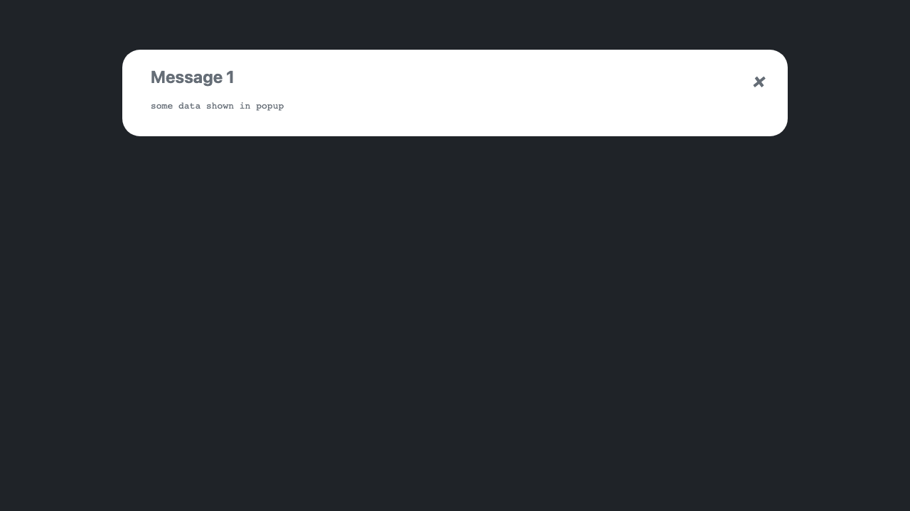

[](https://github.com/semantic-release/semantic-release)
[](https://github.com/lsd-consulting/lsd-core/actions/workflows/ci.yml)
[](https://github.com/lsd-consulting/lsd-core/actions/workflows/nightly.yml)
[](https://github.com/lsd-consulting/lsd-core/releases)
[](https://search.maven.org/search?q=g:%22io.github.lsd-consulting%22%20AND%20a:%22lsd-core%22)
[](https://www.jsdelivr.com/package/gh/lsd-consulting/lsd-core)

# LSD Core

**Living Sequence Diagrams** - Generate interactive sequence and component diagrams from your code automatically.

## Overview

LSD Core is a library for creating sequence diagrams dynamically without needing to write PlantUML markup manually. Simply capture events in your code, and LSD generates interactive HTML reports with:

- **Sequence diagrams** showing message flows between components
- **Component diagrams** visualizing system relationships
- **Interactive popups** with detailed event information
- **Multiple scenarios** grouped into comprehensive reports


## Quick Start

### Installation

Add the dependency to your project: [](https://search.maven.org/search?q=g:%22io.github.lsd-consulting%22%20AND%20a:%22lsd-core%22)

<details>
  <summary>Maven</summary>

```xml
<dependency>
    <groupId>io.github.lsd-consulting</groupId>
    <artifactId>lsd-core</artifactId>
    <version>X.X.X</version>
</dependency>
```

</details>

<details>
  <summary>Gradle</summary>

```groovy
implementation 'io.github.lsd-consulting:lsd-core:X.X.X'
```
</details>

### Basic Usage

Use the `LsdContext` singleton to capture messages and events:

<details open>
  <summary>Kotlin</summary>

```kotlin
fun main() {
    val lsd = LsdContext.instance

    lsd.capture(
        MessageBuilder.messageBuilder().from("A").to("B").label("message1").build(),
        MessageBuilder.messageBuilder().from("B").to("A").label("message2").build(),
    )
    lsd.completeScenario("<Scenario Title>")
    lsd.completeReport("<Report Title>")
}
```
</details>

<details>
  <summary>Java</summary>

```java
public static void main(String[] args) {
    LsdContext lsd = LsdContext.getInstance();
    
    lsd.capture(
        MessageBuilder.messageBuilder().from("A").to("B").label("message1").build(),
        MessageBuilder.messageBuilder().from("B").to("A").label("message2").build()
    );
    lsd.completeScenario("<Scenario Title>", "<description>");
    lsd.completeReport("<Report Title>");
}
```
</details>

The generated HTML report will be in `build/reports/lsd/` by default.

## Advanced Features

### Customizing Participants

Instead of simple strings, create `Participant` objects with custom types, colors, and aliases:

```kotlin
// Instead of "A", use:
val arnie = ACTOR.called("A", "Arnie", "blue")

// Register participants to ensure consistent styling
lsd.addParticipants(listOf(arnie))
```

**Available ParticipantTypes:**
- `ACTOR` - Stick figure representation
- `BOUNDARY` - System boundary
- `COLLECTIONS` - Collection/list
- `CONTROL` - Controller component
- `DATABASE` - Database storage
- `ENTITY` - Business entity
- `PARTICIPANT` - Generic participant (default)
- `QUEUE` - Message queue

### Sequence Events

Beyond messages, you can capture various event types:

| Event | Description |
|-------|-------------|
| `PageTitle` | Sets a title on the diagram |
| `NoteLeft` | Creates a note to the left of a participant |
| `NoteRight` | Creates a note to the right of a participant |
| `NoteOver` | Creates a note over a participant's lifeline |
| `TimeDelay` | Shows elapsed time with optional label |
| `Newpage` | Splits diagram into multiple pages |
| `ActivateLifeline` | Activates a participant lifeline (with optional color) |
| `DeactivateLifeline` | Deactivates an active lifeline |

### Additional Capabilities

**Generate an index page** for multiple reports:
```kotlin
lsd.createIndex()
```

**Create component diagrams** showing relationships across all scenarios:
```kotlin
lsd.completeComponentsReport("Relationships")
```

**Highlight important information** with facts:
```kotlin
// The keyword "Lorem" will be highlighted throughout the report
lsd.addFact("Something to highlight", "Lorem")
```

**Include custom icons** (e.g., Font Awesome):
```kotlin
lsd.includeFiles(listOf("tupadr3/font-awesome-5/heart"))
lsd.capture(NoteLeft("Friends <$heart{scale=0.4,color=red}>"))
```
## Configuration

Customize LSD behavior by adding an `lsd.properties` file to your classpath or setting system properties (which take precedence).

| Property | Default | Description |
|----------|---------|-------------|
| `lsd.core.label.maxWidth` | `200` | Maximum label width (in characters) before abbreviation |
| `lsd.core.diagram.theme` | `plain` | PlantUML theme ([available themes](https://plantuml.com/theme)) |
| `lsd.core.report.outputDir` | `build/reports/lsd` | Output directory for report files |
| `lsd.core.ids.deterministic` | `false` | Generate deterministic HTML element IDs (useful for approval testing) |
| `lsd.core.diagram.sequence.maxEventsPerDiagram` | `50` | Maximum events per diagram before auto-splitting |
| `lsd.core.devMode` | `true` | Offline mode with inline CSS/JS (no CDN dependencies) |
| `lsd.core.metrics.enabled` | `false` | _Experimental:_ Show performance metrics table |

## Gallery

### Report Types

<table>
  <tr>
    <td width="50%">
      <b>Sequence Diagrams with Metrics</b><br/>
      
    </td>
    <td width="50%">
      <b>Interactive Popups</b><br/>
      Click arrows to view detailed event data<br/>
      
    </td>
  </tr>
  <tr>
    <td width="50%">
      <b>Component Diagrams</b><br/>
      Visualize all participants across scenarios<br/>
      
    </td>
    <td width="50%">
      <b>Index Pages</b><br/>
      Navigate between multiple reports<br/>
      
    </td>
  </tr>
</table>

## Ecosystem

**LSD Core** is the foundation library. Several companion libraries automate diagram generation for popular testing frameworks:

- **[lsd-junit5](https://github.com/lsd-consulting/lsd-junit5)** - JUnit 5 extension
- **[lsd-cucumber](https://github.com/lsd-consulting/lsd-cucumber)** - Cucumber plugin
- **[lsd-interceptors](https://github.com/lsd-consulting/lsd-interceptors)** - HTTP/messaging interceptors
- **[More libraries...](https://github.com/lsd-consulting)**


## Development

### Prerequisites

- Java 17 JDK

### Building

```bash
./gradlew clean build
```

Git hooks are configured automatically on first build (uses `.githooks` directory).

### Troubleshooting

#### CDN Cache Issues

Static files (CSS/JS) are cached on JSDelivr CDN for up to 7 days. To force a cache refresh:

1. Use the [JSDelivr Purge tool](https://www.jsdelivr.com/tools/purge)
2. Purge these files:
   - `https://cdn.jsdelivr.net/gh/lsd-consulting/lsd-core@5/src/main/resources/static/style.min.css`
   - `https://cdn.jsdelivr.net/gh/lsd-consulting/lsd-core@5/src/main/resources/static/custom.min.js`
3. Clear your browser cache

**Tip:** Use `lsd.core.devMode=true` (default) to avoid CDN issues during development.

## Contributing

Contributions are welcome! Please feel free to submit a Pull Request.

## License

This project is licensed under the MIT License - see the [LICENSE.txt](LICENSE.txt) file for details.
